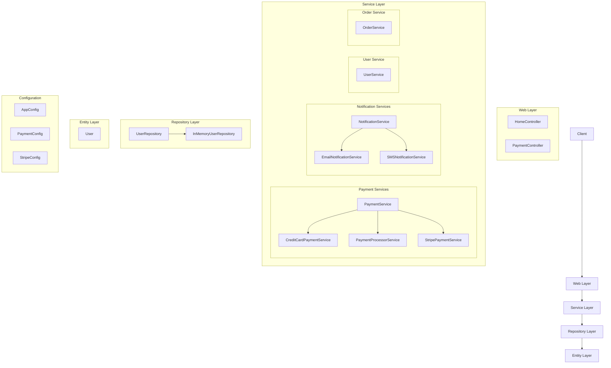

```mermaid
graph TD
    Client[Client] --> Web[Web Layer]
    
    subgraph "Web Layer"
        HC[HomeController]
        PC[PaymentController]
    end
    
    Web --> Service[Service Layer]
    
    subgraph "Service Layer"
        subgraph "Payment Services"
            PS[PaymentService] --> CCPS[CreditCardPaymentService]
            PS --> PPS[PaypalPaymentService]
            PS --> SPS[StripePaymentService]
            PPS[PaymentProcessorService]
        end
        
        subgraph "Notification Services"
            NS[NotificationService] --> ENS[EmailNotificationService]
            NS --> SMSNS[SMSNotificationService]
        end
        
        subgraph "User Service"
            US[UserService]
        end
        
        subgraph "Order Service"
            OS[OrderService]
        end
    end
    
    Service --> Repository[Repository Layer]
    
    subgraph "Repository Layer"
        UR[UserRepository] --> IMUR[InMemoryUserRepository]
    end
    
    Repository --> Entity[Entity Layer]
    
    subgraph "Entity Layer"
        User[User]
    end
    
    subgraph "Configuration"
        AC[AppConfig]
        PC2[PaymentConfig]
        SC[StripeConfig]
    end
```